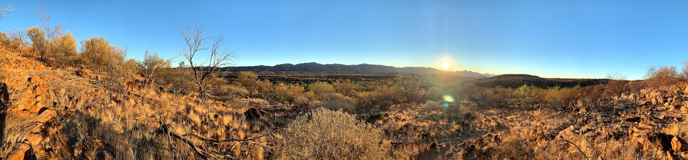

# ⛺ WestMacsApp


[-23.7331833,133.2157583](https://www.google.com/maps/place/23%C2%B043'59.5%22S+133%C2%B012'56.7%22E/@-23.7331454,133.2059951,3586m/data=!3m1!1e3!4m5!3m4!1s0x0:0x0!8m2!3d-23.7331833!4d133.2157583)

## ⛺ Run

`dotnet run --project WestMacsApp`

## ⛺ Test

`dotnet test`

## ⛺ Repo structure

````
WestMacsApp
 |
 --- WestMacsApp.sln
 |
 +-- WestMacsAppCore/
 |
 +-- WestMacsApp.Test/
 ````

<br>

<hr>

*rrr@<span></span>burntsugar.rocks*