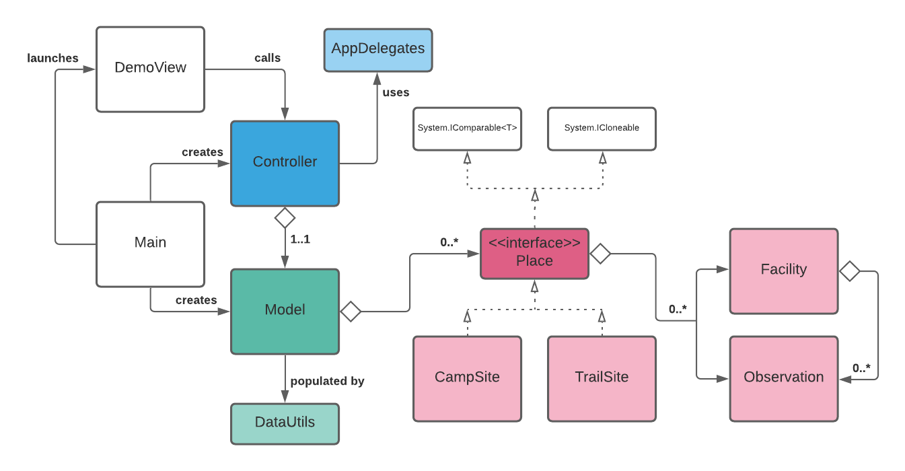

# ⛺ WestMacsApp


[-23.7331833,133.2157583](https://www.google.com/maps/place/23%C2%B043'59.5%22S+133%C2%B012'56.7%22E/@-23.7331454,133.2059951,3586m/data=!3m1!1e3!4m5!3m4!1s0x0:0x0!8m2!3d-23.7331833!4d133.2157583)

## ⛺ Intro

Over the last year or so I have been playing with concept for an app which would assist people who are planning to hike **The Laraptina Trail** in the Northern Territory, AU.

The remote and arid trail traverses 230KM of the West Macdonnell ranges. Water, food and gear must be planned according to the length, terrain and facilities available in each of the 12 sections.

Water is the top priority for anyone venturing out to this trail:
- **it is scarce**: semi-permanent waterholes exist but cannot be relied upon. Hikers rely on the tank water maintained by rangers at each of the trailheads.
- **it is heavy**: Daily intake requirements are variable but an average 5LT is a reasonable estimate. 1LT = 1KG. The ability to augment water supply with (treated) surface water would significantly reduce pack weight.

One of my main hopes for this app is to provide a way for hikers to report the current conditions along the trail - especially those which relate to surface water. These reports would allow hikers to plan their water accordingly, and potentially achieve pack-weight efficiences.

## ⛺ Current project goals

- Consolidate my data and ideas for this app which have been distributed across multiple other platforms and databases.
- Build a section of the class libray.

⚠️ I have **excluded** data modification or persistance from this iteration. All lists returned by the controller are **deep copies**.

## ⛺ Current class diagram



## ⛺ Prerequisites

- [.NET Core 3.1](https://dotnet.microsoft.com/download)

## ⛺ Install

`git clone https://github.com/burntsugar/WestMacsAppCoreCS.git`

## ⛺ Repo structure

````
WestMacsApp
 |
 --- WestMacsApp.sln
 |
 +-- WestMacsAppCore/
 |
 +-- WestMacsApp.Test/
 ````

## ⛺ Run the demo
A handful of features can be seen running in the demo.

`dotnet run --project WestMacsApp`

## ⛺ Test
TTD comprehensive test coverage.

`dotnet test`

## 💧 Water
View sorted lists of places which contain water. Lists are sorted from **east to west**.

- `GetPlacesWithWaterSource() -> List<Place>: all places having some kind of water source.`
- `GetPlacesWithTankWater() -> List<Place>: all places having tank water.`
- `GetCampSitesWithWaterSource() -> List<CampSite>: all camp sites having some kind of water source.`
- `GetCampSitesWithTankWater() -> List<CampSite>: all camp sites having tank water.`
- `GetCampSitesWithTapWater() -> List<CampSite>: all camp sites having tap water.`
- `GetTrailSitesWithWaterSource() -> List<PlTrailSiteace>: all trail sites having some kind of water source.`
- `GetTrailSitesWithTankWater() -> List<TrailSite>: all trail sites having tank water.`

## ⛺ About the data
This build relies upon a .json data file which has been compiled from my initial databases. It represents a *portion* of the collection.

## ⛺ API documentation
XML documentation is built with the project and I am hoping to implement [DocFX](https://dotnet.github.io/docfx/) once it becomes mature enough to manage with .NET Core on MacOS (currently problematic 👿).

<br>

<hr>

*rrr@<span></span>burntsugar.rocks*